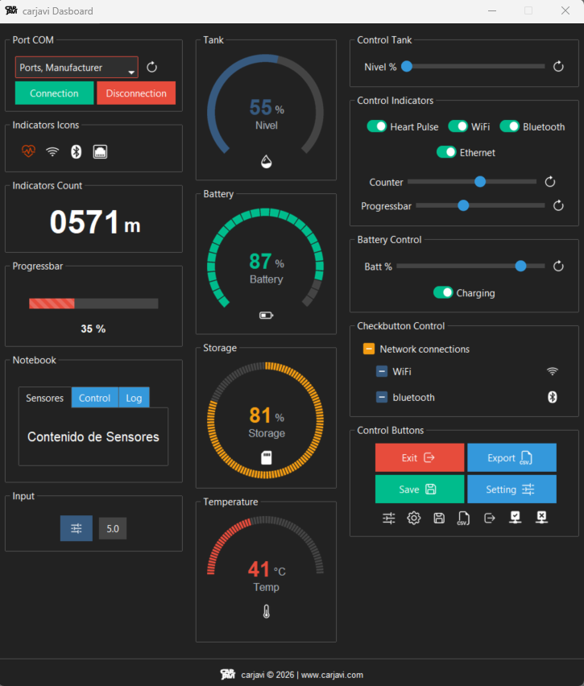
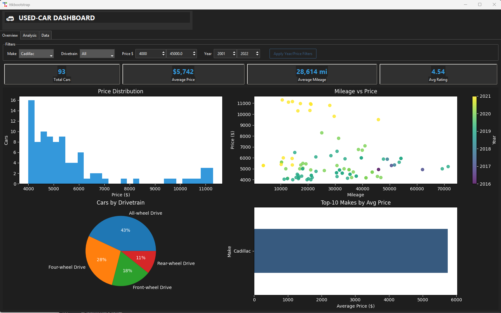

<p align="center"></p>
<h1 align="center"> Python GUI carjavi </h1> 
<h4 align="right">Mar 26</h4>

<p>
  
  
</p>

<br>

# Table of contents
- [Table of contents](#table-of-contents)
- [Install Packages](#install-packages)
  - [Crear entorno (recomendado)](#crear-entorno-recomendado)
  - [Install Framwork \& Icons](#install-framwork--icons)
  - [Instalación de librerias de iconos](#instalación-de-librerias-de-iconos)
    - [All icons](#all-icons)
  - [Charts](#charts)
- [Demos](#demos)
- [Arquitectura típica del proyecto](#arquitectura-típica-del-proyecto)
- [Run](#run)
- [Code GUI-carjavi](#code-gui-carjavi)
- [Code Snippets GUI-carjavi](#code-snippets-gui-carjavi)
  - [The Root Window. Creacion del espacio de trabajo de la GUI](#the-root-window-creacion-del-espacio-de-trabajo-de-la-gui)
  - [Widgets](#widgets)
  - [Lo que va en cada columna. COLUMN (x).](#lo-que-va-en-cada-columna-column-x)
  - [Frame interno para alinear Componentes en una fila X, hijo del frame principal o contenedor, con .grid(). (1 row x 1 Col)](#frame-interno-para-alinear-componentes-en-una-fila-x-hijo-del-frame-principal-o-contenedor-con-grid-1-row-x-1-col)
  - [Frame interno para alinear Componentes en una fila X, hijo del frame principal o contenedor, con .pack() (1 row x 1 Col)](#frame-interno-para-alinear-componentes-en-una-fila-x-hijo-del-frame-principal-o-contenedor-con-pack-1-row-x-1-col)
- [Geometry Managers (métodos)](#geometry-managers-métodos)
    - [Summary](#summary)
  - [.grid()](#grid)
    - [Propiedades principales de .grid()](#propiedades-principales-de-grid)
    - [Configuración Crítica: columnconfigure y rowconfigure](#configuración-crítica-columnconfigure-y-rowconfigure)
    - [Ventajas (Pensamiento Crítico)](#ventajas-pensamiento-crítico)
    - [Desventajas y Críticas](#desventajas-y-críticas)
  - [.pack()](#pack)
    - [Críticas y Desventajas del metodo .pack()](#críticas-y-desventajas-del-metodo-pack)
  - [.place()](#place)
  - [Links de referencias](#links-de-referencias)

<br>

<p align="center"></p>
<p align="center"></p>

```GUI-carjavi```base GUI python framework dashboard (***ttkbootstrap-tkinter***). Es un demo sin logica funcional, solo quise tener mis ```widgets``` dentro de contenedores listos en bloques para usarlos en mis inerfaces futuras. La GUI usa librerias python open source con interfaces responsivas.

<br>

# Install Packages

## Crear entorno (recomendado)
```bash
python -m venv venv
source venv/bin/activate             # Linux/mac
source venv\Scripts\activate         # Windows
```

## Install Framwork & Icons
```bash
python -m pip install ttkbootstrap ttkbootstrap-icons 
```

## Instalación de librerias de iconos
### All icons
```bash
pip install ttkbootstrap-icons-devicon ttkbootstrap-icons-eva ttkbootstrap-icons-fluent-reg ttkbootstrap-icons-ion ttkbootstrap-icons-fluent ttkbootstrap-icons-lucide ttkbootstrap-icons-mat ttkbootstrap-icons-meteocons ttkbootstrap-icons-remix ttkbootstrap-icons-rpga ttkbootstrap-icons-simple ttkbootstrap-icons-typicons ttkbootstrap-icons-weather ttkbootstrap-icons-bs ttkbootstrap-icons-fa ttkbootstrap-icons-gmi
```
## Charts
```bash
pip install ttkbootstrap matplotlib pandas numpy
```

<br>

# Demos
```bash
python -m ttkbootstrap # Visualización de themes
ttkbootstrap-icons # Pantalla de demostración de los iconos disponibles
```

<br>

# Arquitectura típica del proyecto
```bash
Project/
│── app.py  # mi aplicación visual
│── venv/   # Ambien virtual
│── assets/ # todo lo que se necesita para correr la GUI y la aplicación en si
```
<br>

# Run
```bash
python gui-carjavi.py
```

<br>

# Code GUI-carjavi
```bash
...

```


<br>

# Code Snippets GUI-carjavi 

## The Root Window. Creacion del espacio de trabajo de la GUI
```bash
import ttkbootstrap as ttk  

PATH = Path(__file__).parent / 'assets' #Calcula la ruta a la carpeta assets que está junto al script actual. Sobre esa ruta se buscarán las imágenes.

class gui_carjavi(ttk.Frame):                # gui_carjavi hereda de ttk.Frame: es un contenedor principal para toda la interfaz.
    def __init__(self, master):              # constructor que recibe la ventana o frame padre.
        super().__init__(master)             # inicializa el frame base.
        self.pack(fill=BOTH, expand=YES)

        # ════════════════════════════════════════════════════════════════════════
        # MACRO GRID: cuadrícula raíz del Frame principal
        # 3 columnas de igual peso → se expanden proporcionalmente al redimensionar
        # ════════════════════════════════════════════════════════════════════════
        self.columnconfigure(0, weight=1)  # Columna 1: se expande
        self.columnconfigure(1, weight=1)  # Columna 2: se expande
        self.columnconfigure(2, weight=1)  # Columna 3: se expande
        self.rowconfigure(0, weight=1)     # Fila 0 (contenido): se expande verticalmente
        self.rowconfigure(1, weight=0)     # Fila 1 (Linea separador): altura fija
        self.rowconfigure(2, weight=0)     # Fila 2 (footer): altura fija          # fila 1: footer (no se expande)
# ...
# ...
# ...

if __name__ == '__main__':
    app = ttk.Window("carjavi Dashboard", "darkly")  # Crea la ventana principal con tema oscuro
    app.iconbitmap(PATH / 'img/favicon@32x32.ico')   # Icono de la barra de título
    app.resizable(True, True)                        # Permite redimensionar la ventana
    gui_carjavi(app)                                 # Instancia el frame principal
    app.mainloop()                                   # El bucle principal. Este método inicia el bucle de eventos.
```

## Widgets
Widgets are the building blocks of your GUI. They are the elements the user sees and interacts with. Some of the most common widgets include:

* ```Label```: Displays static text or images.
* ```Button```: A clickable button that can trigger a function.
* ```Entry```: A single-line text input field.
* ```Text```: A multi-line text input and display area.
* ```Frame```: An invisible rectangular container used to group other widgets. This is crucial for organising complex layouts.
* ```Canvas```: A versatile widget for drawing shapes, creating graphs, or displaying images.
* ```Checkbutton``` and ```Radiobutton```: For boolean or multiple-choice selections.


## Lo que va en cada columna. COLUMN (x).
```bash
        colx = ttk.Frame(self, padding=10)          # Crea un frame colx dentro de self .
        colx.grid(row=0, column=0, sticky=NSEW)     # Hace que se expanda en todas las direcciones dentro de la celda.

  
```

## Frame interno para alinear Componentes en una fila X, hijo del frame principal o contenedor, con .grid(). (1 row x 1 Col)
```bash
        # Contenedor <NAME> (frame demarcado que contiene todos mis elementos o      componentes visuales)
        container_<name> = ttk.Labelframe(col1, text=' Indicators Count ', padding=10)
        container_<name>.grid(row=2, column=0, sticky=EW, pady=5)  # Fila 2 de col1
        container_<name>.columnconfigure(0, weight=1)  # Columna única se centra

        # Centrar contenido del Contenedor
        <name>_frame_row0 = ttk.Frame(container_<name>)
        <name>_frame_row0.grid(row=0, column=0)  # Sin sticky para centrar

        self.indicator_num_lbl = ttk.Label(          # Label con el número del contador (ej: "0042")
            master=<name>_frame_row0,
            font=("Helvetica", 30, "bold"),          # Fuente grande y negrita
            textvariable=self.indicator_num_var      # Vinculado a la variable de texto
        )
        self.indicator_num_lbl.grid(row=0, column=0, sticky=E, padx=(0, 2))  # Alineado a la derecha
```


## Frame interno para alinear Componentes en una fila X, hijo del frame principal o contenedor, con .pack() (1 row x 1 Col)
```bash
        # Contenedor <NAME> (frame demarcado que contiene todos mis elementos o       componentes visuales)
        Container_<NAME> = ttk.Labelframe(col1, text=' Port COM ', padding=10)       
        Container_<NAME>.pack(side=TOP, fill=BOTH, pady=5) # El contenedor queda del ancho de la columna
        # row(x) es la fila de componentes dentro del contenedor. 
        <NAME>_frame_row(x) = ttk.Frame(Container_<NAME>, padding=5)       
        <NAME>_frame_row(x).pack(anchor=CENTER, pady=(5,0)) # Los elementos quedan centrados en el contenedor
```


<br>

<br>

# Geometry Managers (métodos)

### Summary
```grid()``` : El gestor más potente y flexible, organiza los widgets en una estructura de filas y columnas similar a una tabla, lo que lo hace perfecto para crear diseños alineados y estructurados.

```pack()``` : El gestor más sencillo. Empaca los widgets en la ventana, ya sea vertical u horizontalmente. Es rápido para diseños sencillos, pero ofrece poco control preciso.

```place()``` : El gestor más preciso. Permite especificar las coordenadas exactas de píxeles (x, y) y el tamaño (ancho, alto) de un widget. Generalmente, se recomienda evitar esta opción, ya que hace que la aplicación sea rígida e insensible al redimensionamiento de la ventana.


Mas detalles:

## .grid()
Es el gestor de geometría más potente y profesional de Tkinter. A diferencia de .pack(), que apila widgets, .grid() organiza la interfaz en una tabla invisible de filas y columnas. Es el estándar para formularios, paneles de control y dashboards complejos.

### Propiedades principales de .grid()
```row``` y ```column```: Coordenadas de la celda (empezando en 0).<br>
```sticky```: Define hacia dónde se "pega" el widget si la celda es más grande que él. Usa puntos cardinales (N, S, E, W).<br>
```sticky=EW```: Se estira horizontalmente.<br>
```sticky=NSEW```: Se estira en todas direcciones para llenar la celda.<br>
```rowspan``` y ```columnspan```: Permite que un widget ocupe varias filas o columnas (como "combinar celdas" en Excel).<br>
```padx``` / ```pady```: Margen externo entre la celda y el widget.<br>
```ipadx``` / ```ipady```: Relleno interno del widget.

### Configuración Crítica: columnconfigure y rowconfigure
A diferencia de los otros gestores, .grid() requiere configurar el contenedor padre para que sea responsivo:

```weight```: Determina qué columna o fila crece cuando el usuario estira la ventana. Si una columna tiene weight=1 y otra weight=0, solo la primera se expandirá.

### Ventajas (Pensamiento Crítico)
```Alineación Perfecta```: Es el único que permite alinear etiquetas y campos de entrada de forma tabular sin crear decenas de Frames anidados.

```Mantenimiento Fácil```: Si quieres mover un botón de la fila 2 a la 5, solo cambias el número. En .pack(), tendrías que reordenar todo el código de empaquetado.

```Diseño Responsivo Real```: Al usar weight, tienes control total sobre qué partes de tu Dashboard se estiran y cuáles mantienen su tamaño fijo (como las barras laterales).

### Desventajas y Críticas
```Curva de Aprendizaje```: Es más difícil de entender al principio que .pack(). Si olvidas configurar el weight del padre, tu interfaz se verá "pegada" en una esquina aunque uses sticky=NSEW.

```Celdas Vacías```: Si pones un widget en la row=0 y otro en la row=10, pero no hay nada en medio, Tkinter colapsará las filas 1 a 9 a tamaño cero, lo que puede ser confuso si esperabas un espacio vacío.

> :warning: **Warning:** ```Conflicto Mortal```: Nunca mezcles .grid() y .pack() dentro del mismo contenedor (ej. un Frame). Tkinter entrará en un bucle infinito intentando calcular el tamaño y tu aplicación se colgará (congelará) sin dar error.

<br>

## .pack()
Es el gestor de geometría más sencillo de Tkinter. Funciona bajo el concepto de "empaquetado": imagina que tienes una caja (el contenedor) y vas metiendo objetos uno tras otro, pegándolos a una de las paredes. 

1. Ubicación (```side```)
Determina contra qué borde del contenedor se "empaqueta" el widget.
```
TOP (por defecto): Arriba.
BOTTOM: Abajo.
LEFT: Izquierda.
RIGHT: Derecha.
```

2. Relleno del espacio asignado (```fill```)
Determina si el widget debe estirarse para ocupar el espacio que pack le reservó.
```
NONE (por defecto): Mantiene su tamaño original.
X: Se estira horizontalmente.
Y: Se estira verticalmente.
BOTH: Se estira en ambas direcciones.
```
sample:<br>
```fill=X``` Indica que el widget debe expandirse para ocupar todo el ancho disponible de su contenedor (en este caso, el Labelframe de Scrolling). Sin esto, el frame solo mediría lo mínimo necesario para contener la etiqueta y el slider.

3. Expansión del espacio sobrante (```expand```)
Es un booleano (YES/NO o True/False).

Si es ```YES```, el contenedor le asigna al widget cualquier espacio sobrante en el frame padre. Si hay varios widgets con ```expand=YES```, se reparten el espacio extra.

4. Márgenes Externos (```padx``` y ```pady```)
Espacio fuera del widget (separación con otros widgets).
```
padx=10: 10 píxeles a izquierda y derecha.
padx=(5, 20): 5 píxeles a la izquierda, 20 a la derecha.
pady=10: 10 píxeles arriba y abajo.
pady=(0, 10): 0 arriba, 10 abajo.
```
sample:<br>
```padx=(20, 0)``` Define el relleno externo horizontal (márgen).

5. Márgenes Internos (```ipadx``` e ```ipady```)
Espacio dentro del widget (hace al widget más grande internamente).
```
ipadx=5: Aumenta el ancho interno.
ipady=5: Aumenta el alto interno.
```
6. Alineación en el espacio asignado (```anchor```)
Si el espacio asignado es más grande que el widget, indica hacia dónde "flota". Usa puntos cardinales:
```
N, S, E, W, NE, NW, SE, SW, CENTER.
```
Ejemplo:<br>
Anchor=W (lo pega a la izquierda del espacio que tiene reservado).

### Críticas y Desventajas del metodo .pack()
Aunque es el más usado para prototipos rápidos, tiene fallos estructurales graves para aplicaciones profesionales:

1. El "Efecto Dominó" (Rigidez Secuencial)
El orden en que llamas a .pack() lo determina todo. Si empaquetas un widget a la izquierda (LEFT) y luego otro arriba (TOP), el segundo widget solo podrá ocupar el espacio que dejó el primero. Esto hace que modificar una interfaz compleja sea una pesadilla: mover un solo botón puede desmoronar toda la alineación de los demás.

2. Dificultad para crear Grillas Complejas
Si quieres hacer un formulario con etiquetas alineadas a la izquierda y campos de entrada a la derecha, con .pack() terminarás creando decenas de Frames anidados (un frame para cada fila, o un frame para la columna de etiquetas y otro para la de entradas). Es ineficiente y ensucia el código.

3. Comportamiento Impredecible al Redimensionar
Cuando una ventana se hace muy pequeña, .pack() empieza a "ocultar" widgets en el orden inverso al que fueron añadidos. No tienes un control fino sobre qué debe desaparecer primero o cómo deben colapsar los elementos.

4. No permite Superposición
A diferencia de .place(), con .pack() es imposible poner un widget encima de otro (como un icono sobre una imagen de fondo). Cada widget reclama su propio "bloque" de espacio exclusivo.

> :warning: **Warning:** No puedes mezclar .pack() y .grid() dentro del mismo contenedor padre sin que tu programa se bloquee (congelamiento de la GUI).

<br>

## .place()
es el gestor de geometría más preciso de Tkinter, ya que permite posicionar widgets mediante coordenadas absolutas o relativas.

1. Posicionamiento (```Ejes X e Y```)
```x```: Posición horizontal absoluta en píxeles (ej. x=50). <br>
```y```: Posición vertical absoluta en píxeles (ej. y=100). <br>
```relx```: Posición horizontal relativa al ancho del contenedor padre, de 0.0 a 1.0 (ej. relx=0.5 es el centro horizontal). <br>
```rely```: Posición vertical relativa al alto del contenedor padre, de 0.0 a 1.0 (ej. rely=0.5 es el centro vertical).<br>

2. Dimensiones (```Ancho``` y ```Alto```)
```width```: Ancho absoluto del widget en píxeles.<br>
```height```: Alto absoluto del widget en píxeles.<br>
```relwidth```: Ancho relativo al ancho del padre, de 0.0 a 1.0 (ej. relwidth=0.9 ocupa el 90% del ancho).<br>
```relheight```: Alto relativo al alto del padre, de 0.0 a 1.0.<br>

3. Punto de Anclaje
```anchor```: Define qué parte del widget se sitúa en las coordenadas indicadas (por defecto es NW, esquina superior izquierda).<br>

Valores: N, S, E, W, NE, NW, SE, SW, CENTER.<br>

Ejemplo:<br>
Si usas relx=0.5, rely=0.5, anchor=CENTER, el widget quedará perfectamente centrado.

4. Otros ```inside``` , ```outside``` y ```bordermode```
```bordermode```: Define si el borde del padre se incluye en el cálculo de la posición. <br>
```inside``` (por defecto): Ignora el borde.<br>
```outside```: Incluye el borde.<br>

> :warning: **Warning:** ***place()*** es potente para diseños fijos o superposiciones (como iconos sobre imágenes), pero ```no es responsivo```. Si el usuario estira la ventana, los widgets con coordenadas absolutas (x, y) no se moverán, lo que puede romper tu interfaz. Usa siempre relx y rely si quieres que mantengan su posición proporcional.

##  Links de referencias
https://ttkbootstrap.readthedocs.io/en/latest/ <br>
https://israel-dryer.github.io/ttkbootstrap-icons/ <br>
https://github.com/israel-dryer/ttkbootstrap?utm_source=chatgpt.com <br>
https://towardsdatascience.com/building-a-modern-dashboard-with-python-and-tkinter/ <br>

<br>

<br>

---

<div>
  <p>
     Copyright &nbsp;&copy; 2023 Instinto Digital <a href="https://carjavi.github.io/" title="carjavi.github">carjavi</a>
  </p>
</div>

<p align="center">
    <a href="https://instintodigital.net/" target="_blank"></a>
</p>


